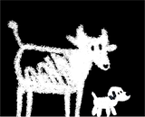
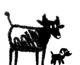

# DS — a design system for self-contained analytical HTML

Two files, no dependencies, no build step, no external requests. Extracted from the CU Dairy
dashboards so the same look and behaviour can be reused in other pages.

```
ds.css                      tokens, theming, ~30 components
ds.js                       chart builders + page behaviours, one global `DS`
styleguide.html             live reference — every token, component and chart, with the code
assets/brand-onlight.png    the mark, black panel  — shown on a LIGHT page
assets/brand-ondark.png     the mark, white panel  — shown on a DARK page
assets/favicon.png          32px tab icon
assets/brand.base64.json    the same three, base64, for single-file pages
```

**Start here:** open `styleguide.html` in a browser. It is a working page built from the two
files, so anything you see there you can copy.

## Use it

```html
<link rel="stylesheet" href="ds.css">
<body class="ds-body ds">
  <div class="ds-wrap"> … </div>
  <script src="ds.js"></script>
</body>
```

`ds` scopes the box-sizing reset; `ds-body` applies the page background and type. Everything is
namespaced `ds-`, so it will not collide with an existing stylesheet.

**Inlining into one file** (the pattern the dashboards use — a single portable `.html`) works
too: paste `ds.css` into a `<style>` and `ds.js` into a script block. `ds.js` deliberately
contains no literal script-closing sequence anywhere, including in its comments, so it survives
that. Keep it that way if you edit it.

## Theming

Three states: system (default), forced light, forced dark.

```css
:root                              { --ds-page: #f9f9f7; }  /* always define light */
@media (prefers-color-scheme: dark) {
  :root:not([data-theme="light"])  { --ds-page: #0d0d0d; }  /* system dark */
}
:root[data-theme="dark"]           { --ds-page: #0d0d0d; }  /* forced dark wins */
```

**Never give a colour its only definition inside a media query** — it will be undefined for
half your readers. `DS.theme.bind(button)` wires a toggle whose label always names the theme you
would switch *to*.

## Brand — header mark and footer notice

The mark is **two files, the same drawing on a filled panel, inverted**. Both sit in the markup;
the stylesheet hides one.

```html
<div class="ds-brandrow">
  <a class="ds-logolink" href="…" aria-label="View on GitHub">
    
    
  </a>
  <div><h1 class="ds-title">…</h1><p class="ds-sub">…</p></div>
</div>
```

They are named for **where they are shown**, not for what they contain:
`brand-onlight.png` is the **black** panel, because a black panel is what contrasts with a light
page. The original filenames (`lightModeIcon`) invited exactly the wrong guess.

**The swap is CSS, never JavaScript.** A script runs after first paint, so the reader would see
a flash of the wrong icon on every load. Both images ship in the HTML and CSS decides.

The footer pairs a rights/provenance notice with the mark:

```html
<div class="ds-foot">
  <div class="ds-notice">
    <div class="ds-noticetext">
      <p class="ds-noticehead">Heading of the notice</p>
      <p>Body of the notice…</p>
    </div>
    <div class="ds-footbrand">
      <a class="ds-logolink" href="…"> …the two imgs… </a>
      <span class="ds-byline">your-name</span>
    </div>
  </div>
</div>
```

The notice is **serif and small on purpose** — it should read as a footnote rather than as part
of the analysis, while still being leaded and justified well enough to be read. On a phone it
stacks and drops the justification, because justified 10.5px text in a narrow column produces
rivers of white space.

**Single-file pages:** swap each `src` for the matching base64 string in
`assets/brand.base64.json` (18 KB per mark, 1.5 KB favicon). That is how the dashboards stay one
portable `.html` with no external requests.

## Components

`ds-wrap` `ds-header/title/sub` `ds-nav/navlink` `ds-btn` `ds-chips/chip` `ds-tabs/tab`
`ds-views/vchip` `ds-filters/fgroup/flabel` `ds-tiles/tile` `ds-scale` `ds-grid`
`ds-card` (+ `ds-chead` `ds-ctitle` `ds-cbtns` `ds-tgl` `ds-csub` `ds-plot` `ds-legend` `ds-tv`)
`ds-table` `ds-tools/search` `ds-tip` `ds-badge` `ds-callout` `ds-bars/barrow` `ds-empty`
`ds-foot/notice/noticetext/noticehead/footbrand/byline` `ds-brandrow/brand/logolink`.

State lives in ARIA — `aria-pressed`, `aria-selected`, `aria-current` — not in classes, so the
styling and the accessibility tree cannot drift apart.

A card's children have a **fixed order**, because `DS.notes()` locates the description by
position: `.ds-chead → [.ds-views] → .ds-csub → .ds-plot → .ds-legend → .ds-tv`.

## JavaScript

```js
DS.bar(host, cats, data, opts)          // vertical bars, optional reference lines
DS.stack(host, cats, series, opts)      // stacked bars; pass pctOf for honest shares
DS.line(host, cats, series, opts)       // multi-series, guide line, all-series tooltip
DS.scatter(host, points, opts)          // nearest-point hover + click-through
DS.histogram(host, values, opts)        // share labels, cumulative curve, median/mean

DS.card(o) DS.tabs(...) DS.notes(root) DS.search(input, fn) DS.theme.bind(btn)
DS.table(cols, rows, opts) DS.sortRows(rows, get, dir)
DS.tip.show/hide/row/head  DS.legend(key, items)  DS.onLegendToggle(redraw)
DS.ticks DS.frame DS.el DS.fmt DS.pct DS.esc
```

Charts draw in viewBox units and are scaled by CSS, so pointer coordinates are divided by
`rendered / DS.W` before hit-testing. Decorative marks are `pointer-events:none` and **one
overlay owns hovering** — that is what makes a 4px dot or a thin line easy to hover.

Set `DS.W` / `DS.H` before drawing to change chart size (e.g. `DS.W = 1180; DS.H = 400` when a
card is zoomed).

## Rules the system encodes

These are conventions, not code, but the components assume them:

1. **Every number carries its n.** Tiles have a `.ds-n` line for exactly this.
2. **Flag any denominator under 20.** Show `3 of 15`, not `20%`.
3. **Colour means one thing per chart.** If bars stack by category A, the legend shows category
   A. A legend describing a different encoding is worse than no legend.
4. **Percentages need a stated denominator.** `DS.stack` takes `pctOf` because a bar carried by
   a single series otherwise reports 100% of itself — true and useless.
5. **Contradictions are content.** When sources disagree, show both and mark the conflict.
6. **The reader's theme wins.**
7. **Motion is optional** — everything animated sits inside
   `@media (prefers-reduced-motion: no-preference)`.

## Two traps worth knowing

**The tooltip is driven by `opacity`, not `display`.** `.ds-tip` is `opacity:0` with a
transition. If you drive `display` instead, the tooltip positions correctly, fires correctly,
and is invisible — with no error anywhere. Test for `opacity === 1`, not for "a tooltip fired".

**`.ds-tv` is `display:none` until the card gets `ds-table-on`.** Populating it without the
Table button means the table exists and nobody can reach it. Use `.ds-tvopen` for a table that
*is* the content rather than an alternate view of a chart.
